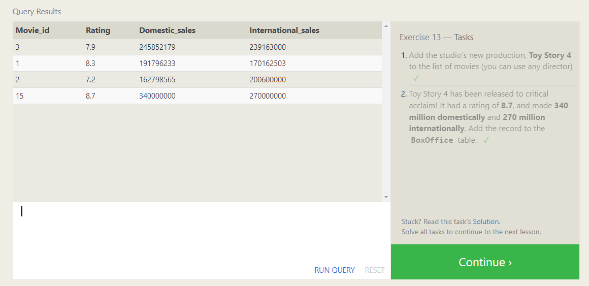
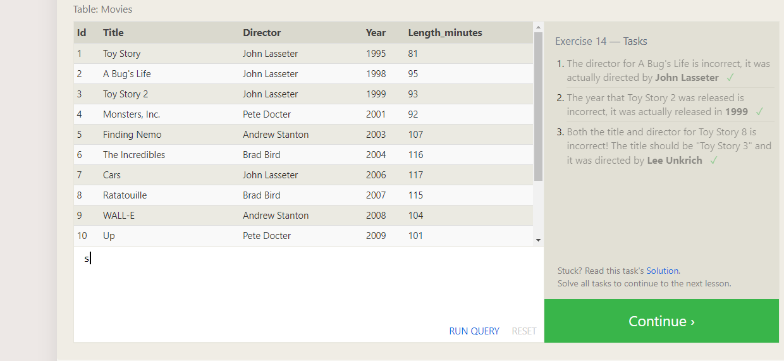
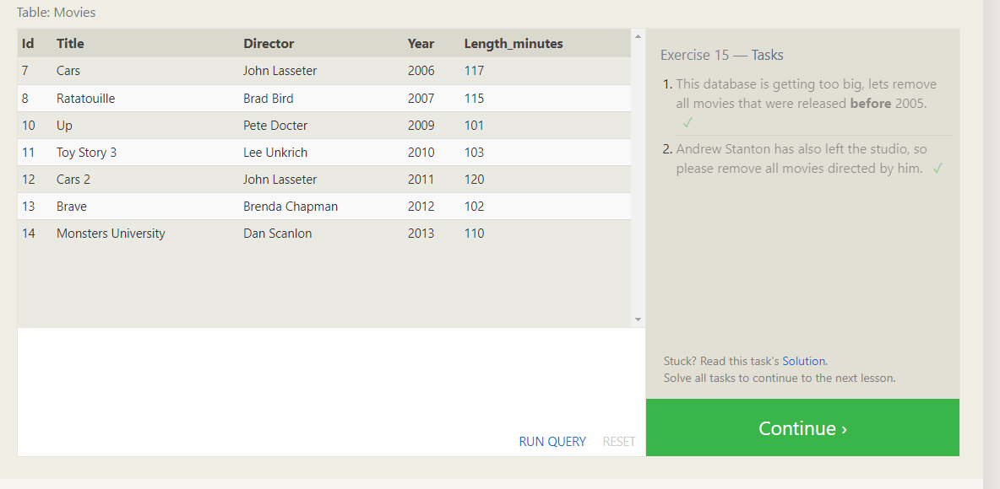
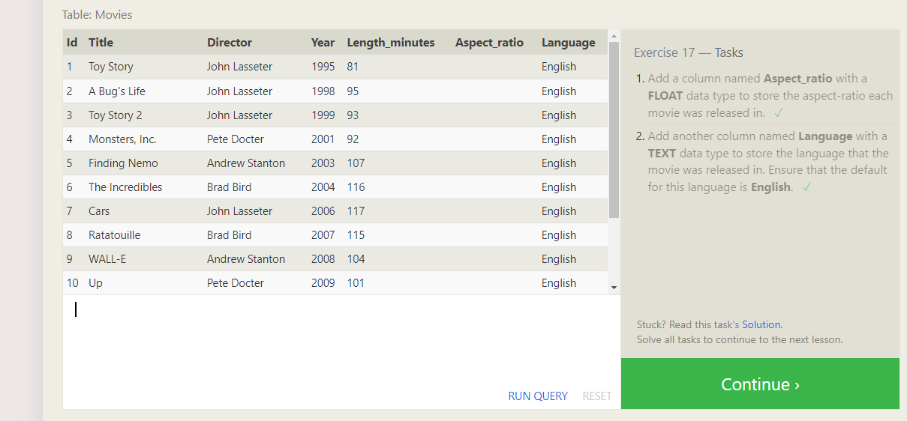
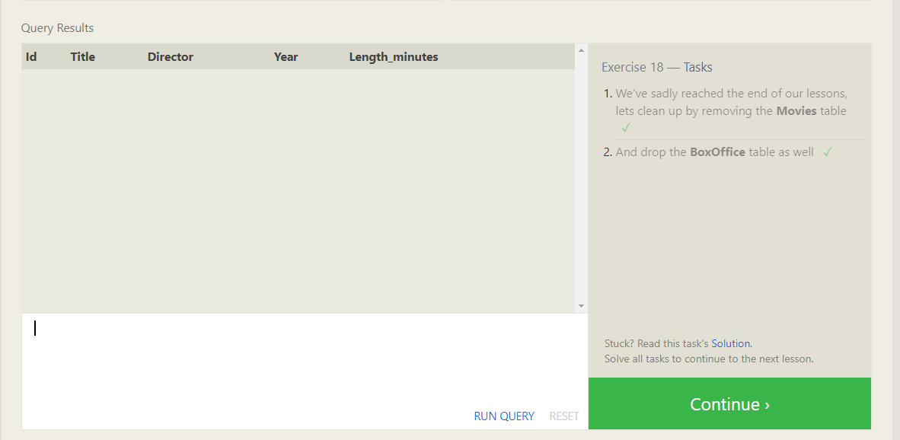

[Go To Home Page ](./READEME.md)
# Database Management

|  summarizing |  Image |
|---|---|
|   |   |
| The **INSERT INTO** statement is used to insert new records in a table.  |   |
| The **UPDATE** statement is used to modify the existing records in a table.  |   |
| The **DELETE** statement is used to delete existing records in a table.   |   |
| The **CREATE TABLE** statement is used to create a new table in a database. |   |
|The **ALTER TABLE** statement is used to add, delete, or modify columns in an existing table.  |   |
| The **DROP TABLE** statement is used to drop an existing table in a database. |   |