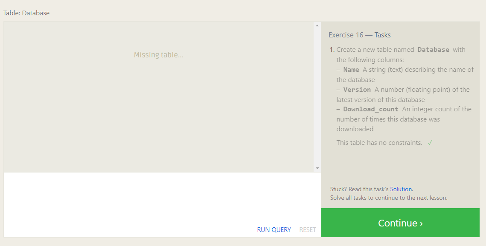

[Go To Home Page ](./READEME.md)
# Database Management


|  summarizing |  Image |
|---|---|
|   |   |
| The **INSERT INTO** statement is used to insert new records in a table.  |   |
| The **UPDATE** statement is used to modify the existing records in a table.  |   |
| The **DELETE** statement is used to delete existing records in a table.   |   |
| The **CREATE TABLE** statement is used to create a new table in a database. |   |
|The **ALTER TABLE** statement is used to add, delete, or modify columns in an existing table.  |   |
| The **DROP TABLE** statement is used to drop an existing table in a database. |   |

## Queries
- UPDATE rows
```
UPDATE table SET c1 = value, c2 = value, … WHERE condition;
```
- DELETE FROM table 
```
DELETE FROM table WHERE condition;
```
-  CREATE TABLE 
```
CREATE TABLE IF NOT EXISTS table-name ( column1 DataType TableConstraint DEFAULT default_value, column2 DataType TableConstraint DEFAULT default_value, … );
```
- Altering tables

***Adding column***
```
ALTER TABLE table ADD column DataType OptionalTableConstraint DEFAULT default_value;
```
***Deleting column***
```
ALTER TABLE table DROP column-name;
```
***Renaming the table***
```
ALTER TABLE mytable RENAME TO new_table_name;
```
-  DROP TABLE 
```
DROP TABLE IF EXISTS table-name;
```
