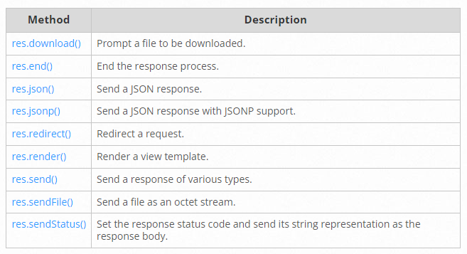

# Express REST API

# Classes
Are a template for creating objects. They encapsulate data with code to work on that data. Classes in JS are built on prototypes but also have some syntax and semantics that are not shared with ES5 class-like semantics.
# Defining classes
To declare a class, you use the class keyword with the name of the class ("Rectangle" here).
```
class Rectangle {
  constructor(height, width) {
    this.height = height;
    this.width = width;
  }
}
```
# Hoisting
Functions can be called in code that appears before they are defined, classes must be defined before they can be constructed.
```
const p = new Rectangle(); // ReferenceError

class Rectangle {}
```
# Class expressions
Can be named or unnamed
```
// unnamed
let Rectangle = class {
  constructor(height, width) {
    this.height = height;
    this.width = width;
  }
};
console.log(Rectangle.name);
// output: "Rectangle"

// named
let Rectangle = class Rectangle2 {
  constructor(height, width) {
    this.height = height;
    this.width = width;
  }
};
console.log(Rectangle.name);
```
# Class body and method definitions
The body of a class is the part that is in curly brackets {}. This is where you define class members, such as methods or constructor.
# Strict mode
The body of a class is executed in strict mode,Strict mode removes some JavaScript silent errors by converting them to throw errors and to ensure that the JavaScript engines achieve increased optimizations.
# Constructor
Is a special method for creating and initializing an object created with a class. There can only be one special method with the name "constructor" in a class. can use the super keyword to call the constructor of the super class.
# Prototype methods
```
class Rectangle {
  constructor(height, width) {
    this.height = height;
    this.width = width;
  }
  // Getter
  get area() {
    return this.calcArea();
  }
  // Method
  calcArea() {
    return this.height * this.width;
  }
}

const square = new Rectangle(10, 10);

console.log(square.area); // 100
```
# Sub classing with extends
The super keyword is used to call corresponding methods of super class. 
# Routing
The router calls a function based on the URL.The router refers to how an application’s respond to client requests.

**create basic rout:**
```
const express = require('express')
const app = express()

// respond with "hello world" when a GET request is made to the homepage
app.get('/', (req, res) => {
  res.send('hello world')
})
```
# Route methods
GET, POST, PUT, DELETE,
```
// GET method route
app.get('/', (req, res) => {
  res.send('GET request to the homepage')
})

// POST method route
app.post('/', (req, res) => {
  res.send('POST request to the homepage')
})
//requests to the route “/secret” whether using GET, POST, PUT, DELETE.
app.all('/secret', (req, res, next) => {
  console.log('Accessing the secret section ...')
  next() // pass control to the next handler
})
```
# Route paths
Route paths, in combination with a request method, define the endpoints at which requests can be made. Route paths can be strings, string patterns, or regular expressions.

This route path will match requests to the root route, /.
```
app.get('/', (req, res) => {
  res.send('root')
})
```
# Route parameters
Route parameters are named URL segments that are used to capture the values specified at their position in the URL
```
app.get('/users/:userId/books/:bookId', (req, res) => {
  res.send(req.params)
})
```
# Route handlers

A single callback function can handle a route. For example:
```
app.get('/example/a', (req, res) => {
  res.send('Hello from A!')
})
```
More than one callback function can handle a route
```
app.get('/example/b', (req, res, next) => {
  console.log('the response will be sent by the next function ...')
  next()
}, (req, res) => {
  res.send('Hello from B!')
})
```
# Response methods


# express.Router
It is a mini express application without all the bells and whistles of an express application, just the routing stuff.
Create a router file named birds.js in the app directory
```
const express = require('express')
const router = express.Router()

// middleware that is specific to this router
router.use((req, res, next) => {
  console.log('Time: ', Date.now())
  next()
})
// define the home page route
router.get('/', (req, res) => {
  res.send('Birds home page')
})
// define the about route
router.get('/about', (req, res) => {
  res.send('About birds')
})

module.exports = router
```
Then, load the router module in the app:
```
const birds = require('./birds')

app.use('/birds', birds)
```
The app will now be able to handle requests to /birds and /birds/about, as well as call the timeLog middleware function that is specific to the route.

