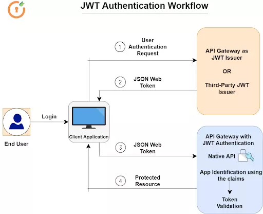

## What is JSON Web Token?
- It is an open standard.
- used to share security information between two parties (client and a server). 
- are signed using a cryptographic algorithm to ensure that the claims cannot be altered after the token is issued.
## When should you use JSON Web Tokens?
- **Authorization:** This is the most common scenario for using JWT

- **Information Exchange:** JSON Web Tokens are a good way of securely transmitting information between parties. 
## What is the JSON Web Token structure?
A JWT is a string made up of three parts, separated by dots (.), and serialized using base64.

- Header
- Payload
- Signature

Therefore, a JWT typically looks like the following.
 xxxxx.yyyyy.zzzzz.

 ### Header
 Two parts: 
 - the type of the token 
 - signing algorithm being used, such as HMAC SHA256 or RSA.
```
{
  "alg": "HS256",
  "typ": "JWT"
}
```
###  Payload
Conatains claims: Claims are statements about an entity (typically, the user) and additional data. 

### There are three types of claims:
- Registered claims.
- Public claims.
- Private claims.
```
{
  "sub": "1234567890",
  "name": "John Doe",
  "admin": true
}
```
## Signature
To create the signature part you have to take the encoded header, the encoded payload, a secret, the algorithm specified in the header, and sign that.

```
HMACSHA256(
  base64UrlEncode(header) + "." +
  base64UrlEncode(payload),
  secret)
  ```
  

  ## How does JWT Authentication work
 