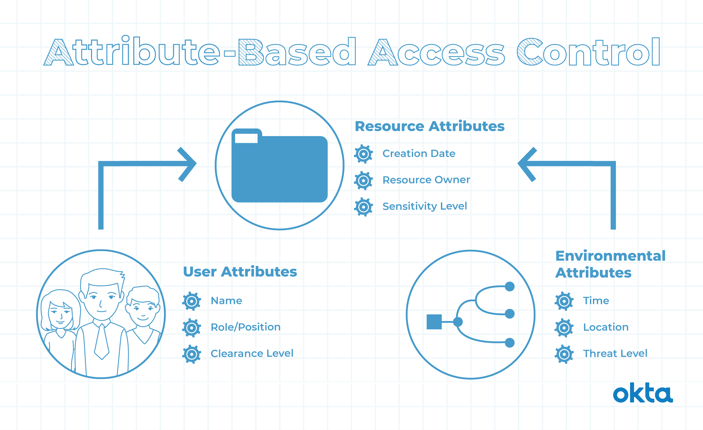

**Access control lists (ACL)**
could be used to allow users from one department to make changes to a document, while only allowing users from other departments to read the document
## What Is Role-Based Access Control?
Role-based access control is control over user groups and access to resources based on a defined role. Someone logs into your computer system. What can that person do? If you use RBAC techniques, the answer to that question depends on that person's rolesuch as:
- Departments
- Locations
- Seniority levels 
- Work duties

With a role defined, you can assign permissions:

1. Access. What can the person see?
2. Operations. What can the person read? What can the person write? Can the person create or delete files?
3. Sessions. How long can the person stay in the system? When will the login work? When will the login expire?

## Benefits Of RBAC
1. Security
2. Selective access
3. Security as a function of organizational structure
4. Separation of duties (SoD)
5. Flexibility
**Attribute-based access control (ABAC)**
Attribute-based access control (ABAC) is an authorization strategy that defines permissions based on attributes.ABAC controls access based on a combination of attributes,as user attributes, resource attributes, attributes associated with the system and environmental attributes.
## What Is Attribute-Based Access Control? 
1. User:A person's job title, typical tasks.
2. Resource attributes: The type of file, the person who made it.
3. Environment:Where the person is accessing the file.
