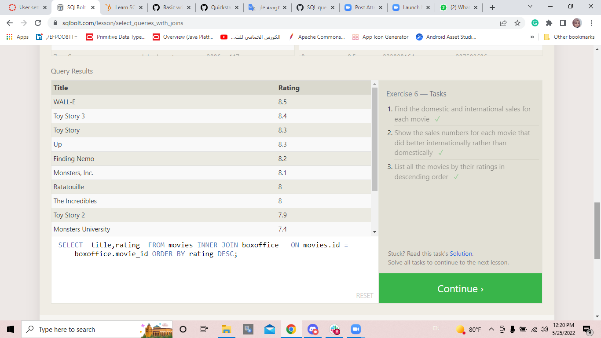

[Go To Home Page ](./READEME.md)
# SQL Queries 
 
| summarizing  | Image |
|---|---|
|The **SELECT** statement is used to select data from a database.The data returned is stored in a result table  |  |
| The **WHERE** clause is used to filter records.  |  |
|operators can be used in the WHERE clause =,>,<,<=,>=,**LIKE**, **NOT LIKE**,..etc |  |
| The SELECT **DISTINCT** statement is used to return only distinct (different) values. The **ORDER BY** keyword is used to sort the result-set in ascending or descending order. The **LIMIT row_count** determines the number of rows returned by the query. The **OFFSET** will specify where to begin counting the number rows from.|  |
| SQL Review:   |   |
| The **INNER JOIN** selects all rows from both tables as long as there is a match between the columns.   |   |