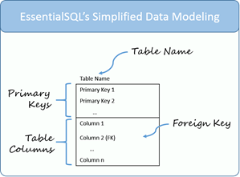

# SQL vs NoSQL

|  **SQL**  | **NoSQL**   |
|---|---|
| Relational Databases  |  non-relational database.  |
|  table based, which consists of n number of rows of data. |  document based.ollection of key-value pair, documents, graph databases or wide-column stores|
|  have predefined schema.  |  do not have standard schema definitions.  |
|   vertically scalable. |  horizontally scalable. |
|   uses **SQL** ( structured query language ) for defining and manipulating the data| **UnQL** (Unstructured Query Language queries are focused on collection of documents.) |
| SQL database examples: MySql, Oracle, Sqlite, Postgres and MS-SQL.  |  NoSQL database examples: MongoDB, BigTable, Redis, RavenDb, Cassandra, Hbase, Neo4j and CouchDb. |
|good fit for the complex query.  | not good fit for complex queries.  |
| not best fit for hierarchical data storage  | fits better for the hierarchical data storage.  |
| **vertically scalable**.You can manage increasing load by increasing the CPU, RAM, SSD, etc, on a single server.  |  **horizontally scalable**You can just add few more servers easily in your NoSQL database infrastructure to handle the large traffic. |
|  emphasizes on ACID properties  ( Atomicity, Consistency, Isolation and Durability) | follows the Brewers CAP theorem ( Consistency, Availability and Partition tolerance )  |
| classify as either open-source or close-sourced from commercial vendors.  |   classified on the basis of way of storing data as graph databases.|

## SQL Database Examples
1. MySQL Community Edition
2. MS-SQL Server Express Edition
3.  Oracle Express Edition
## NoSQL Database Examples
1. MongoDB
2. CouchDB
3. Redis

## Easy To Understand Data Modeling Concepts
There are many types of modeling software you can use to create models, such as MySql Workbench, that create smart looking diagrams also  generate the code to create the database.
### Data Modeling – Table Elements 

- **Table Name**:  located at the top of the table.
- **Primary Keys**: uniquely identify each row in a table.
- **Table Columns**: There can be one or more table columns.To keep the diagrams simple, I don’t show the data types.
- **Foreign Key**:column or set of columns which match a primary key in another table

### Data Modeling – Table Relationships

