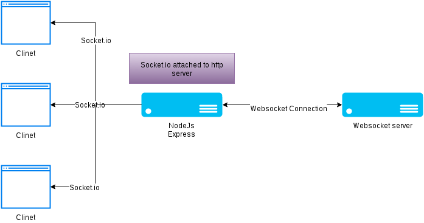

## Socket.io
## What is a Web Socket?
 - is a bidirectional communication protocol that can send the data from the client to the server or from the server to the client by reusing the established connection channel.
 -  remains open all the time
 
 ## Wat is Socket.io 
  is a JavaScript library and it will upgrade a connection between a client and a server to WebSocket protocol. 

 - **Client-Side:** it is the library that runs inside the browser
 - **Server Side:** It is the library for Node.js

 

 ## WebSocket vs Socket.io
| WebSocket  |  Socket.io |
|---|---|
|protocol that is established over the TCP connection | It is the library to work with WebSocket   |
|provides full-duplex communication on TCP connections.| Provides the event-based communication between browser and server.  |
|Proxy and load balancer is not supported in WebSocket.   |A connection can be established in the presence of proxies and load balancers   |
|It doesn’t support broadcasting.  | 	It supports broadcasting.  |
|It doesn’t have a fallback option.   | It supports fallback options.  |

## Key features of WebSocket 
1. provides full-duplex communication
2. helps in real-time communication between the Client and the webserve
3. It stands over an HTTP connection that it provides full-duplex communication
## Key features of Socket.IO
1. It helps in broadcasting to multiple sockets at a time.
2. It works on all platform, server or device, ensuring equality, reliability, and speed.
3. It automatically upgrades the requirement to WebSocket
4. It requires both libraries Client side as well as a server-side library.

These are some reserved events on the server-side socket object:
```
Connect
Message
Disconnect
Reconnect
Ping
Join
Leave
```
Also there is reserved events on the client-side socket object:
```
Connect
Connect_error
Connect_timeout
Reconnect, etc.
```
### JavaScript client example
- Once the socket is created, we should listen to events on it. There are totally 4 events:

1. open – connection established.
2. message – data received.
3. error – websocket error.
4. close – connection closed.

```
// Creates new WebSocket object with a wss URI as the parameter
const socket = new WebSocket('wss://game.example.com/ws/updates');

// Fired when a connection with a WebSocket is opened
socket.onopen = function () {
  setInterval(function() {
    if (socket.bufferedAmount == 0)
      socket.send(getUpdateData());
  }, 50);
};

// Fired when data is received through a WebSocket
socket.onmessage = function(event) {
  handleUpdateData(event.data);
};

// Fired when a connection with a WebSocket is closed
socket.onclose = function(event) {
  onSocketClose(event);
};

// Fired when a connection with a WebSocket has been closed because of an error
socket.onerror = function(event) {
  onSocketError(event);
};
```

Sockets work based on events. These are some reserved events, which can be accessed using the socket object on the server-side:

Connect
Message
Disconnect
Reconnect
Ping
Join
Leave

