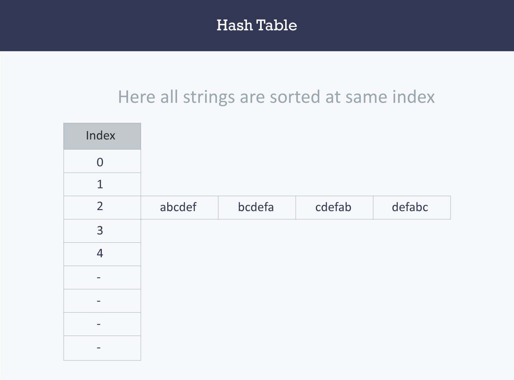
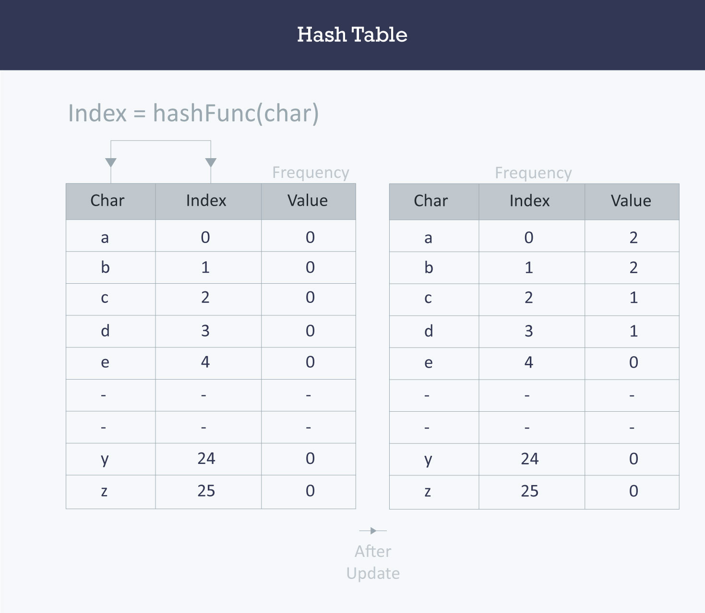

## What is a Hashtable?
Hashing is a technique that is used to uniquely identify a specific object from a group of similar objects. Some examples of how hashing is used in our lives include:
- In universities, each student is assigned a unique roll number that can be used to retrieve information about them.
- In libraries, each book is assigned a unique number that can be used to determine information about the book, such as its exact position in the library 
## Hashing is implemented in two steps:
- An element is converted into an integer by using a hash function. This element can be used as an index to store the original element, which falls into the hash table.
- The element is stored in the hash table where it can be quickly retrieved using hashed key.

hash = hashfunc(key)
index = hash % array_size
## Hash function
A hash function is any function that can be used to map a data set of an arbitrary size to a data set of a fixed size, which falls into the hash table. The values returned by a hash function are called hash values, hash codes, hash sums, or simply hashes.
## To achieve a good hashing mechanism,
- Easy to compute
- Uniform distribution
- Less collisions
## hash function
The hash function will compute the same index for all the strings and the strings will be stored in the hash table in the following format. As the index of all the strings is the same, you can create a list on that index and insert all the strings in that list.

## Hash table
A hash table is a data structure that is used to store keys/value pairs. It uses a hash function to compute an index into an array in which an element will be inserted or searched. By using a good hash function, hashing can work well.
Let us consider string S. You are required to count the frequency of all the characters in this string.

```js
string S = “ababcd”
```
```js
 void countFre(string S)
    {
        for(char c = ‘a’;c <= ‘z’;++c)
        {
            int frequency = 0;
            for(int i = 0;i < S.length();++i)
                if(S[i] == c)
                    frequency++;
            cout << c << ‘ ‘ << frequency << endl;
        }
    }
```

## output

 ```js
 a 2
b 2
c 1
d 1
e 0
f 0
z 0
```

Let us apply hashing to this problem. Take an array frequency of size 26 and hash the 26 characters with indices of the array by using the hash function.

```js
 int Frequency[26];

    int hashFunc(char c)
    {
        return (c - ‘a’);
    }

    void countFre(string S)
    {
        for(int i = 0;i < S.length();++i)
        {
            int index = hashFunc(S[i]);
            Frequency[index]++;
        }
        for(int i = 0;i < 26;++i)
            cout << (char)(i+’a’) << ‘ ‘ << Frequency[i] << endl;
    }
```
## Output
``` a 2
b 2
c 1
d 1
e 0
f 0
…
z 0
```

