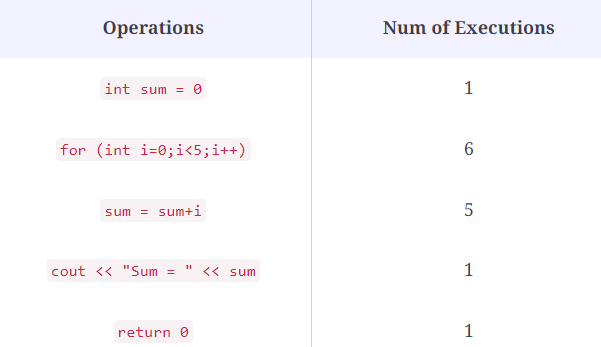

# Linked Lists
**What is Big O ?**

 Is a mathematical notation that describes the limiting behavior of a function or algorithm.
 To measure the efficiency of an algorithm, we need to consider two things.

 **Time Complexity**: How much time does it take to run completely?

**Space Complexity**: How much extra space does it require in the process  to store data and instructions?
 ## How is complexity calculated?
 1. List down all the basic operations in the code.
2. Count the number of times each gets executed.
3. Sum all the counts to get an equation.

Example:
 
 - Calculations:1+6+5+1+1
 - Generalizing this notation =>1+(n+1) + n + 1+1
- After simplifying the above expression=>2n +4
## How do you estimate the Big-O notation of an algorithm?
1. ignore the constants
2. Ignore the lower order 
After performing the two steps the Big-O notation:
=>2n+4=> n+4=>=> n=> O(n)
## To evaluate a function for Time and Space complexity
 we should consider 4 Key Areas:
 1. Input Size
 2. Units of Measurement
 3. Orders of Growth
 4. Best Case, Worst Case, and Average Case

## Linked lists

is a linear sequence of nodes that are connected together.node contains a value and a pointer to the next node. The first node is called ***head***, the last node is called  ***tail***( node that refers to nul), Each node contains a property called ***Next***.
***node***consist of two parts:Data and reference to next node
## Types of Linked Lists:
1. **Singly**: one reference and there is refer to next node. start at the head node and navigate from the root until last node that pointing to empty null value. 
2. **Doubly**:two references within the node, reference to both the Next and Previous node.
3. **Multiply Linked List**:
4. **Circular Linked List**:it doesn’t end with a node pointing to a null value.it has a node that acts as the tail, and the node after the tail node is the beginning of the list.

## Add elements and remove elements from a linked list

(rearrange our pointers) 
- to insert an element into a linked list - in the ***beginning***:
1. **First** find the head node .
2. **Next** create a new node, and set its pointer to the current first node.
3. **Last** rearrange head node’s pointer to point to new node.
 - to insert an element into a linked list in the ***Ending***:
 1. **First** Find the node that we want to change the pointer of( the last node).
2. **Next** Create the new node  and set its pointer (to null).
3. **Last** Direct the last node’s pointer to new node
## Properties of the Linked List
## The main operations of a linked list data structure are:
1. **insertAt**: Inserts element. 
2. **removeAt**: Removes the element.
3. **getAt**: Retrieves the element at the specific index.
4. **clear**: Empties the linked list.
5. **reverse**: Reverses the order of elements.

