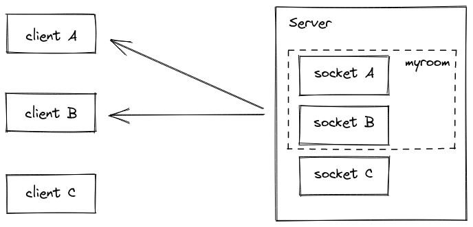

## Message Queues
## Rooms
A room is an arbitrary channel that sockets can join and leave. It can be used to broadcast events to a subset of clients

## Joining and leaving
***join()***

```
io.on("connection", (socket) => {
  socket.join("some room");
});
```
### When broadcasting or emitting use ***to*** or ***in*** :
```
io.to("some room").emit("some event");
```
### Emit to several rooms at the same time
```
io.to("room1").to("room2").to("room3").emit("some event");
```
### broadcast to a room from a given socket
```
io.on("connection", (socket) => {
  socket.to("some room").emit("some event");
});
```
### To leave a channel by calling ***leave*** as join.

## Namespaces
is a communication channel that allows to divide the logic of  application through a single shared connection "multiplexing".


### namespace has:

- event handlers
- rooms
- middlewares

### Main namespace called /
### Custom namespaces
call the ***of*** function on the server-side
### Dynamic namespaces
```
io.of(/^\/dynamic-\d+$/);
```