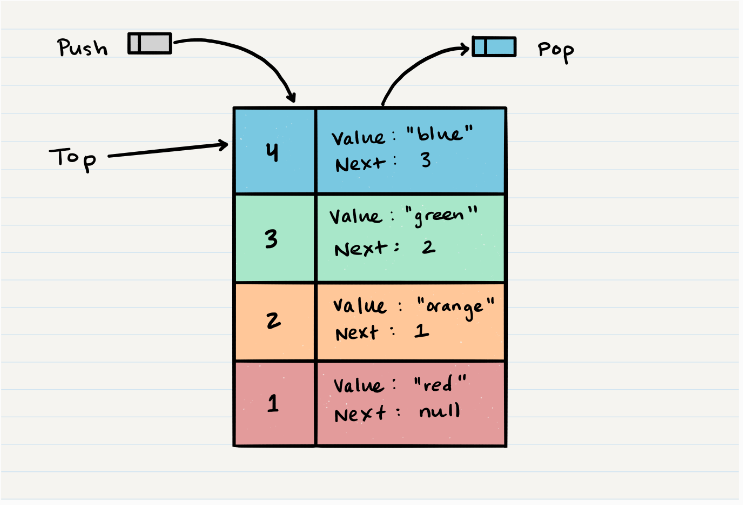
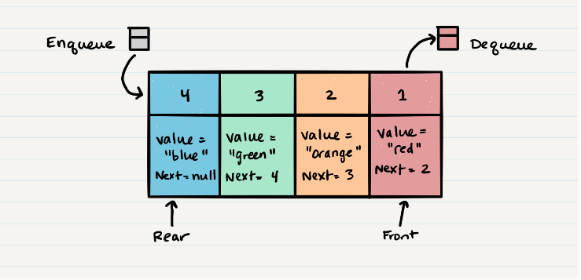

## Stacks and Queues
 ## What is a Stack
 A stack is a data structure that contains of Nodes. Each Node pointer to next Node in the stack.
 

 Stacks follow these concepts:
- **FILO (First In Last Out)**
- **LIFO (Last In First Out)**
## Common terminology for a stack is
1. **Push** - Nodes or items that are put into the stack are pushed. Put nodes into the stack. O(1)
```
ALOGORITHM push(value)

node = new Node(value)

node.next <-- Top

top <-- Node
```
2. **Pop** - Nodes or items that are removed from the stack are popped. When you attempt to pop an empty stack an exception will be raised.Remove nodes from the stack. O(1)
```
ALGORITHM pop()

Node temp <-- top

top <-- top.next

temp.next <-- null

return temp.value

//Pop an empty stack >> exception will be raised.
```
3. **Top** - This is the top of the stack.
4. **Peek** - When you peek you will view the value of the top Node in the stack. When you attempt to peek an empty stack an exception will be raised.. O(1)
```
ALGORITHM peek()

return top.value

//Peek an empty stack >> exception will be raised.
```
5. **IsEmpty** - returns true when stack is empty otherwise returns false. O(1)
```
ALGORITHM isEmpty()

return top = NULL
```
## What is a Queue ?


Queues follow these concepts:

- **FIFO (First In First Out)**
- **LILO (Last In Last Out)**

Common terminology for a queue is

1. **Enqueue** - Nodes or items that are added to the queue.O(1)
```
ALGORITHM enqueue(value)

node = new Node(value)

rear.next <-- node

rear <-- node
```
2. **Dequeue** - Nodes or items that are removed from the queue. If called when the queue is empty an exception will be happened. O(1)
```
ALGORITHM dequeue()

Node temp <-- front

front <-- front.next

temp.next <-- null

return temp.value

//If called when the queue is empty >> exception will be raised.
```
3. **Front** - The first Node of the queue.
4. **Rear** - The last Node of the queue.
5. **Peek** - view the value of the front Node in the queue. If called when the queue is empty an exception will be happened.O(1)
```
ALGORITHM peek()

return front.value

//If called when the queue is empty >> exception will be raised.
```
6. **IsEmpty** - returns true when queue is empty otherwise returns false.O(1)

```
ALGORITHM isEmpty()

return front = NULL
```