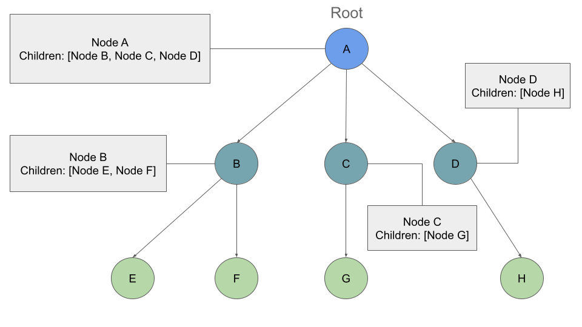
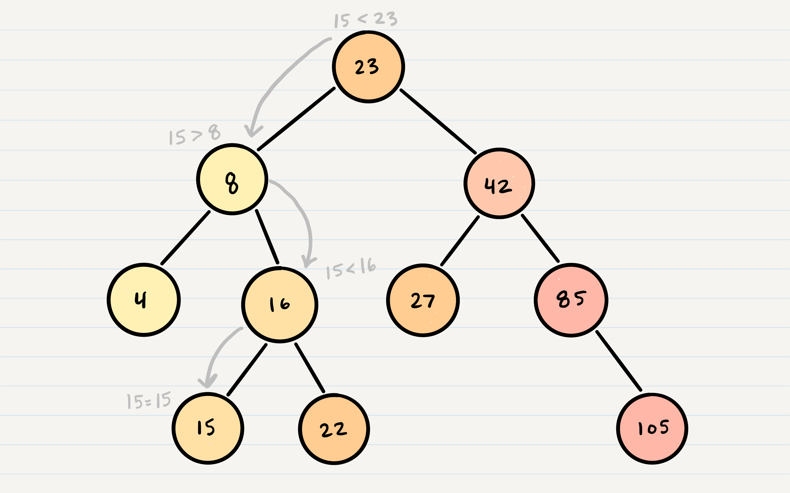

## Trees
### Type of trees
1. Binary Trees.
2. Binary Search Trees.
3. K-ary Trees.
## Common Terminology
- **Node:**  stores the actual data of that particular element and link to next element
- **Root:** first node 
- **K:** A number that determine  the maximum number of children any node may have in a k-ary tree. In a binary tree, k = 2
- **Left:** A reference to one child node, in a binary tree
- **Right:** A reference to the other child node, in a binary tree
- **Edge:** the connecting link between any two nodes
- **Leaf:** node which does not have a child 
- **Height:** the total number of edges from leaf node to a particular node in the longest path  
 
 ## Two categories of traversals when it comes to trees:
 1. **Depth First**
 three methods for depth first traversal:

- ***Pre-order:*** root >> left >> right
- ***In-order:***  left >> root >> right
- ***Post-order:*** left >> right >> root

Examle:

- ***Pre-order:*** A, B, D, E, C, F
- ***In-order:*** D, B, E, A, F, C.
- ***Post-order:*** D, E, B, F, C, A.
 2. **Breadth First**

 Output: A, B, C, D, E, F
 ## Binary Tree Vs K-ary Trees
 **K-ary tree** is a rooted tree, where each node can hold at most k number of children.

**Binary Trees** restrict the number of children to two (hence our left and right children).

## Breadth First Traversal
moving down a list of children of length k.

example:

Output: A, B, C, D, E, F, G, H

## Binary Search Trees (BST)
Nodes are organized in a manner where all values that are smaller than the root are placed to the left, and all values that are larger than the root are placed to the right.
## Searching a BST

 a BST search is with a while loop. We cycle through the while loop until we hit a leaf, or until we reach a match with what we’re searching for.
